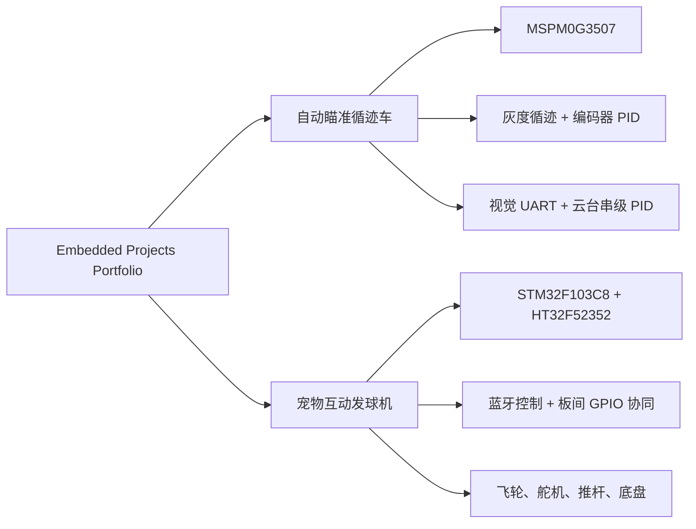

# Personal Embedded Projects Portfolio

个人嵌入式项目作品集，收录以 MCU 为核心的软硬件协同项目。每个项目尽量保留可阅读的固件源码、硬件资源说明、通信协议、控制逻辑、工程文件及实物材料，展示从外设驱动、闭环控制到多控制器协同的实现过程。

## 项目列表

| 项目 | 主控平台 | 核心内容 |
| --- | --- | --- |
| [自动瞄准循迹车](automatic%20aiming%20device/README.md) | TI MSPM0G3507 | 灰度循迹、双轮编码器速度闭环、视觉串口通信、两自由度云台串级 PID 与激光使能控制 |
| [宠物互动发球机](ball-machine/README.md) | STM32F103C8 + HT32F52352 | 双控制器协同、蓝牙短帧通信、飞轮发球、舵机拨球、底盘位置 PID、推杆与 OLED 调试显示 |

## 项目概览

## 自行瞄准装置

基于 TI MSPM0G3507 的移动控制平台。小车使用灰度传感器进行循迹，左右轮通过编码器速度反馈实现 PID 闭环；视觉模块经 UART 发送目标中心坐标，MCU 控制两自由度云台持续跟踪目标。

### 项目材料

- [项目说明与源码](automatic%20aiming%20device/README.md)
- [项目作品集 PDF](automatic%20aiming%20device/pdf/Automatic-Aiming-Device-Description.pdf)

### 开发环境

- Code Composer Studio 21
- MSPM0 SDK 2.05.01.00
- SysConfig 1.28.0
- TI Arm Clang 5.1.1 LTS

---

## 智能宠物球发球机

面向宠物互动和训练场景的自动发球控制系统。项目采用 STM32F103C8 与 HT32F52352 双 MCU 架构：HT32 负责蓝牙通信、双飞轮和舵机拨球，STM32 负责底盘位置闭环、推杆和 OLED 显示；两块控制板通过 GPIO 脉冲协同完成动作控制。

### 项目材料

- [项目说明与源码](ball-machine/README.md)
- [项目作品集 PDF](ball-machine/pdf/)

### 开发环境

- Keil MDK
- STM32F103C8 工程
- HT32F52352 工程

---

## License

除非另有说明，本仓库内容仅用于个人作品展示、学习和交流。
