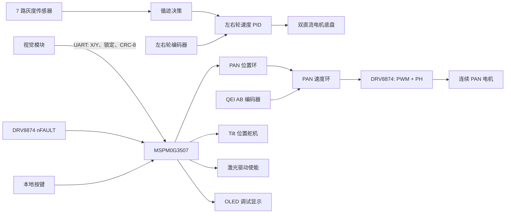

# 自动瞄准循迹车

基于 TI MSPM0G3507 的嵌入式移动平台。项目将灰度循迹、双轮编码器速度闭环、视觉串口通信与两自由度云台控制集成在同一 CCS 工程中：小车沿轨迹运动，云台根据视觉端输出的目标偏差持续修正指向，并控制激光使能。

本仓库用于展示项目的当前实现，不包含 CCS、SDK、编译产物或历史工程备份。

## 作品集材料

- [项目作品集 PDF](pdf/Automatic-Aiming-Device-Description.pdf)

PDF 中包含实物原型、系统框图和 CCS SysConfig 配置截图；仓库专注保留可阅读、可导入的工程源码。

## 系统架构



底盘链路根据灰度状态生成左右轮速度目标，并以编码器反馈执行速度闭环。云台链路将视觉目标相对画面中心的偏差作为输入：水平误差经过位置环得到目标角速度，速度环基于 QEI 反馈输出 PAN PWM 占空比；垂直误差转换为 Tilt 舵机角度增量。

## 项目能力

- 灰度传感器循迹，双直流电机编码器速度 PID 闭环控制。
- 通过 UART 接收视觉端目标锁定状态与 X/Y 偏差，驱动云台跟踪目标。
- PAN 轴采用直流减速电机、QEI AB 编码器与 DRV8874 驱动，执行位置环与速度环的串级 PID 控制。
- Tilt 轴采用位置舵机，依据视觉 Y 轴误差持续积分并限制在 20-160 度范围内。
- 目标丢失超过 100 ms 时，PAN 轴恢复固定角速度扫描；DRV8874 `nFAULT` 低电平触发时停止 PAN 并关闭激光。
- 支持循迹、单圈瞄准、双圈瞄准和画圆等按键选择任务模式。

## 控制链路

```text
灰度传感器 -> 循迹判断 -> 左右轮目标速度 -> 编码器速度 PID -> 底盘电机

视觉 UART -> X/Y 误差
  X 误差 -> PAN 位置 PID -> 目标角速度 -> PAN 速度 PID -> DRV8874 PH/PWM
  Y 误差 -> Tilt 位置 PID -> 目标角度积分 -> 位置舵机 PWM
```

系统定时由 `TIMG12` 的 1 ms 中断驱动：底盘速度环每 10 ms 更新一次，PAN 速度环每 20 ms 更新一次；主循环处理按键状态、循迹逻辑、OLED 显示和视觉帧更新。

## 任务与运行节拍

| 任务 | 行为 | 云台模式 |
| --- | --- | --- |
| 任务 1 | 小车单独循迹，可选择圈数 | 空闲，激光关闭 |
| 任务 2 | 小车搭载云台循迹一圈并瞄准 | `GIMBAL_AIMING` |
| 任务 3 | 小车搭载云台循迹两圈并瞄准 | `GIMBAL_AIMING` |
| 任务 4 | 小车循迹一圈并执行画圆相关流程 | 空闲，激光关闭 |

按键扫描由 1 ms 时基调用；底盘双电机速度 PID 每 10 ms 更新；云台的编码器速度计算和速度环每 20 ms 更新。将高频周期控制与非周期的视觉帧处理分离，可以避免串口接收阻塞底盘和云台闭环。

## 视觉 UART 协议

视觉模块只需发送目标框中心点和锁定状态。接收状态机完成帧头同步与 CRC-8 校验后，才更新云台输入。

```text
AA 55 X_L X_H Y_L Y_H Locked CRC8
```

| 字段 | 长度 | 说明 |
| --- | ---: | --- |
| `AA 55` | 2 字节 | 固定同步帧头 |
| `X_L X_H` | 2 字节 | 目标中心 X 坐标，16 位小端整数 |
| `Y_L Y_H` | 2 字节 | 目标中心 Y 坐标，16 位小端整数 |
| `Locked` | 1 字节 | 非零表示目标有效且已锁定 |
| `CRC8` | 1 字节 | 对帧头和 5 字节载荷计算，CRC-8 多项式 `0x07` |

当前固件以 `(160, 120)` 为画面中心，即视觉端应发送 `320 x 240` 坐标系内的目标框中心点。使用不同分辨率时，应在视觉端缩放坐标，或同步调整 `Vision_Init()` 的中心参数。协议实现见 `Drivers/Hardware/vision.c`。

## 云台状态与安全行为

1. 进入瞄准任务后，云台归中，`PB23` 控制的激光使能置为有效。
2. 有效视觉帧到达时，MCU 计算 X/Y 图像误差，分别驱动 PAN 串级 PID 与 Tilt 角度更新。
3. 视觉数据超过 100 ms 未更新时，PAN 恢复预设角速度搜索。
4. DRV8874 `nFAULT` 为低电平时，控制器切入故障模式，停止 PAN 并关闭激光。

激光使能是低层 GPIO 控制，不代表项目具备任何激光安全认证。上电调试与实物运行应保持人工监管，并根据实际激光驱动板的逻辑电平和供电方式确认保护措施。

## 硬件与资源配置

| 子系统 | MCU 外设与引脚 | 用途 |
| --- | --- | --- |
| 主控 | MSPM0G3507, LQFP-64 | 系统控制与外设管理 |
| 底盘 PWM | TIMG0 / PA12, PA13 | 左右轮电机 PWM |
| 底盘编码器 | PA9, PA7 | 左右轮速度反馈 |
| 灰度传感器 | PA15, PB2, PB3, PB8, PB9, PB12, PB20 | 循迹输入 |
| 视觉通信 | UART0 / PA10, PA11 | 115200 bps 视觉 UART |
| PAN 电机 PWM | TIMG6 CC0 / PB26 | DRV8874 PWM 输入 |
| PAN 方向 | PB22 | DRV8874 PH 输入 |
| PAN 故障 | PA14 | DRV8874 `nFAULT` 低有效输入 |
| PAN 编码器 | TIMG8 QEI / PA29, PA30 | AB 相位置与速度反馈 |
| Tilt 舵机 | TIMG7 CC1 / PA18 | 50 Hz 位置舵机 PWM |
| 激光使能 | PB23 | 激光驱动使能 |

外设资源以 [automatic-aiming-device.syscfg](automatic-aiming-device.syscfg) 为准；生成的 `Debug/ti_msp_dl_config.c/.h` 不应手动编辑。

## 硬件联调检查

- 确认底盘两路 PWM、方向和编码器相位与软件符号一致，再整定左右轮 PID。
- 确认 PAN 电机方向、QEI AB 相次序与正方向定义一致，再整定位置环和速度环参数。
- 先在激光关闭状态下验证目标在画面四角时的 PAN/Tilt 响应方向。
- 确认视觉模块发送的是目标框中心，而非左上角；坐标系应与 `(160, 120)` 中心定义一致。
- 确认 `nFAULT`、激光驱动和 MCU 共地，且故障状态下激光实际关闭。

## 工程结构

```text
main.c                         系统初始化、任务状态与主循环
automatic-aiming-device.syscfg MSPM0 外设、时钟和引脚配置
Drivers/Hardware/gimbal.c      云台状态机、串级 PID、QEI 和故障处理
Drivers/Hardware/motor_pid.c   底盘双电机速度 PID
Drivers/Hardware/gray_track.c  灰度循迹逻辑
Drivers/Hardware/vision.c      视觉 UART 数据接收与目标状态
Drivers/Hardware/oled.c        OLED 显示
```

## 构建环境

- Code Composer Studio 21
- MSPM0 SDK 2.05.01.00
- SysConfig 1.28.0
- TI Arm Clang 5.1.1 LTS

在 CCS 中导入本目录后，打开 `automatic-aiming-device.syscfg` 生成配置，再构建 `Debug` 配置。

构建成功仅验证软件链路。编码器分辨率、PAN 轴方向、PID 参数、舵机中位和激光驱动逻辑仍需结合具体硬件上板整定。

## 代码阅读入口

- `main.c`：系统初始化、任务状态机和 1 ms/10 ms/20 ms 调度关系。
- `Drivers/Hardware/vision.c`：视觉短帧状态机、CRC-8 与坐标误差计算。
- `Drivers/Hardware/gimbal.c`：串级 PID、视觉超时搜索、故障停机与激光使能。
- `Drivers/Hardware/gray_track.c`：灰度传感器组合与循迹决策。
- `automatic-aiming-device.syscfg`：外设实例、PWM、QEI、UART 和引脚资源。
