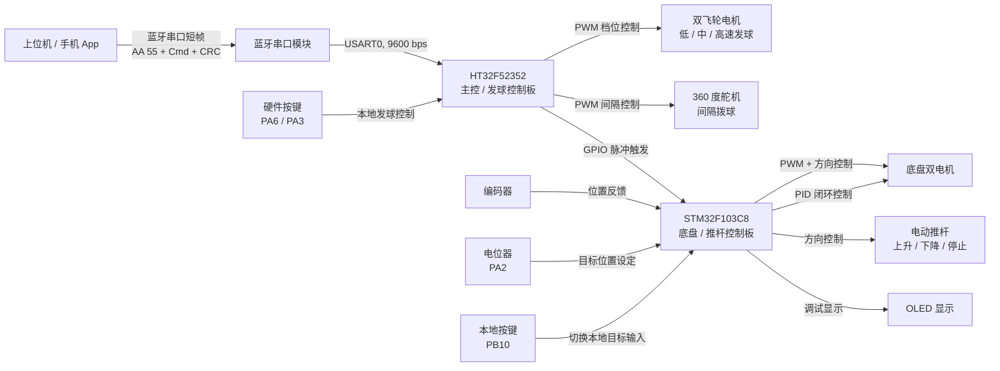
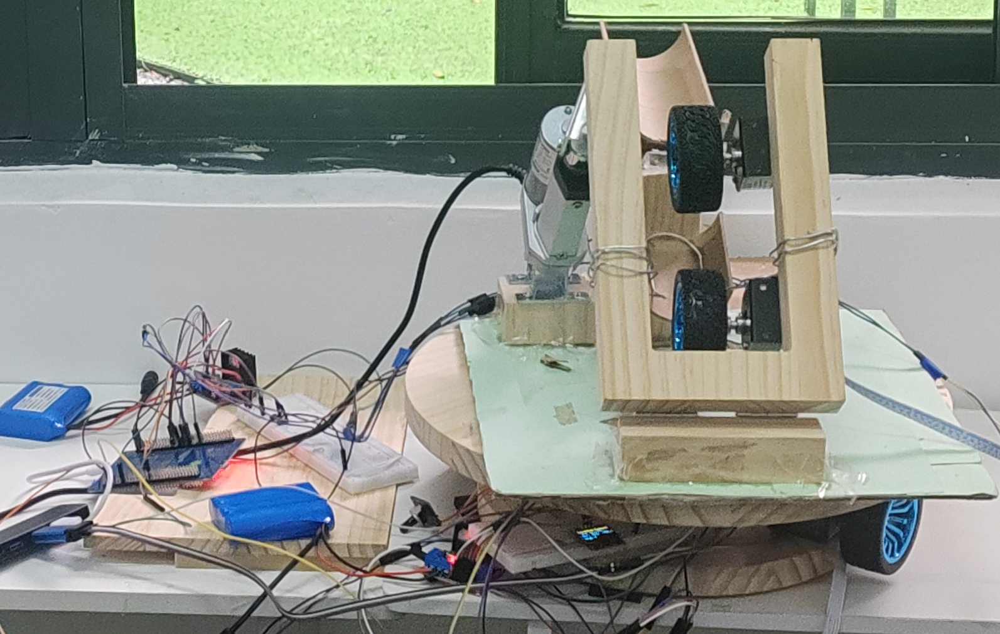
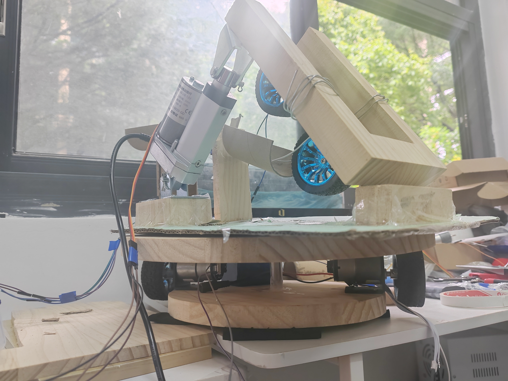
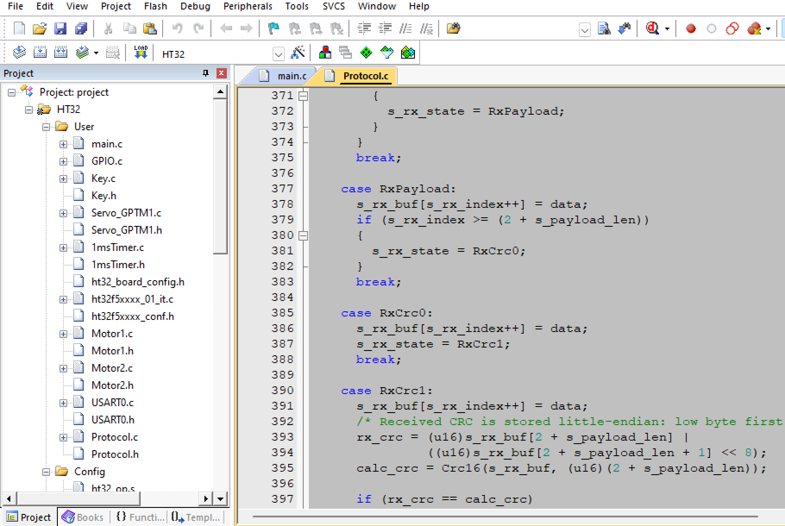
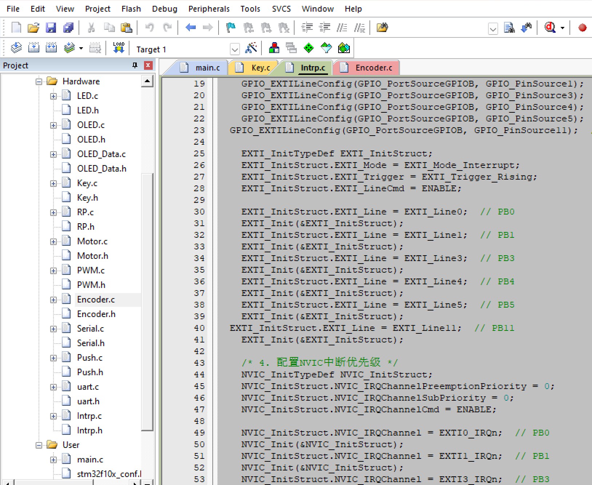

# ball machine - 宠物互动发球机双控制器嵌入式控制系统

本项目面向宠物陪伴和互动训练场景，实现了一套宠物球自动发射与角度调节控制系统。系统使用 STM32F103C8 和 HT32F52352 两块 MCU 协同完成底盘定位、推杆升降、飞轮发球、舵机间隔拨球、蓝牙串口控制和本地硬件按键控制。

## 系统框图



## 实物与工程截图

<p align="center">
  
  
</p>

<p align="center">图 1 发球机正面及控制板联调实物图　　图 2 发球机侧面及升降结构实物图</p>

<p align="center">
  
  
</p>

<p align="center">图 3 HT32控制部分　　图 4 STM32控制部分</p>

图 3 展示了 HT32 端 `Protocol.c` 的接收状态机、负载长度判断和 CRC16 校验流程；图 4 展示了 STM32 端的 GPIO 外部中断配置，用于接收 HT32 发出的板间动作触发脉冲。

## 项目功能

- 面向宠物球发射场景，可用于宠物互动、运动消耗和定点投球训练
- 蓝牙串口接收上位机短帧命令
- 支持本地硬件按键控制，不依赖手机也可以切换发球相关功能
- 双飞轮电机 PWM 档位控制：停止、低速、中速、高速
- 360 度舵机按间隔运行：停止、慢、中、快
- STM32 侧底盘电机 PID 闭环位置控制
- 编码器采集底盘位置反馈
- 推杆上升、下降、停止控制
- OLED 显示目标值、反馈值、输出量和调试状态
- HT32 与 STM32 之间通过 GPIO 脉冲完成板间动作触发

## 硬件组成

| 模块 | 型号/说明 | 主要职责 |
|---|---|---|
| 控制板 1 | STM32F103C8 | 底盘电机、编码器、推杆、OLED、本地按键 |
| 控制板 2 | HT32F52352 | 飞轮电机、舵机、蓝牙串口、硬件按键、板间 GPIO 输出 |
| 执行机构 | 直流电机、360 度舵机、推杆 | 宠物球发射、间隔拨球、升降和底盘运动 |
| 传感器/输入 | 编码器、电位器、按键、蓝牙模块 | 位置反馈、目标设定和用户输入 |

## 控制逻辑

### STM32 控制板

STM32 负责底盘和推杆相关动作。底盘通过编码器读取当前位置，并使用位置式 PID 控制计算 PWM 输出，驱动两路底盘电机同步运动。STM32 还通过外部中断接收 HT32 输出的 GPIO 脉冲，执行底盘左/中/右目标位置和推杆上/下/停动作。

主要代码位置：

- `STM32 Control/User/main.c`
- `STM32 Control/Hardware/Motor.c`
- `STM32 Control/Hardware/Encoder.c`
- `STM32 Control/Hardware/Push.c`
- `STM32 Control/Hardware/Intrp.c`

### HT32 主控/发球板

HT32 负责蓝牙串口协议解析、飞轮电机档位、舵机间隔模式，以及向 STM32 输出 GPIO 脉冲触发底盘/推杆动作。HT32 侧同时保留两个本地硬件按键：按键 1 循环切换飞轮档位，按键 2 循环切换舵机间隔模式，用于现场脱离手机的手动控制和调试。

主要代码位置：

- `HT32    Control/project/main.c`
- `HT32    Control/project/Protocol.c`
- `HT32    Control/project/USART0.c`
- `HT32    Control/project/Motor1.c`
- `HT32    Control/project/Motor2.c`
- `HT32    Control/project/Servo_GPTM1.c`

### 本地硬件按键控制

| 控制板 | 引脚 | 代码位置 | 功能 |
|---|---|---|---|
| HT32 | PA6 | `HT32    Control/project/Key.c` | 硬件按键 1，循环切换飞轮档位：停止、低速、中速、高速 |
| HT32 | PA3 | `HT32    Control/project/Key.c` | 硬件按键 2，循环切换舵机间隔模式：停止、慢、中、快 |
| STM32 | PB10 | `STM32 Control/Hardware/Key.c` | 硬件按键，切换是否使用电位器目标值 |

HT32 的两个硬件按键通过 20 ms 周期扫描完成消抖，按键释放时生成一次按键事件。主循环读取按键事件后更新 `KeyMotor` 和 `KeyServo`，因此蓝牙命令和本地硬件按键最终共用同一套飞轮档位、舵机模式状态变量。

| 控制入口 | 对应功能 | 共享状态 |
|---|---|---|
| 蓝牙命令 `CmdSetThrowGear` | 直接设置飞轮档位 | `KeyMotor` |
| HT32 硬件按键 1 | 按停止、低速、中速、高速循环切换飞轮档位 | `KeyMotor` |
| 蓝牙命令 `CmdSetServoMode` | 直接设置舵机间隔模式 | `KeyServo` |
| HT32 硬件按键 2 | 按停止、慢、中、快循环切换舵机间隔模式 | `KeyServo` |

## 蓝牙通信协议

HT32 蓝牙入口使用短帧协议，由 USART0 接收：

```text
AA 55 Seq Cmd Payload CRC_L CRC_H
```

协议完成帧头同步、CRC16 校验、命令分发和 ACK/NACK 回包。

当前命令：

| 命令字 | 功能 |
|---|---|
| `0x11` | 设置飞轮电机档位：0 停止，1 低速，2 中速，3 高速 |
| `0x20` | 设置舵机间隔模式：0 停止，1 慢，2 中，3 快 |
| `0x30` | 设置底盘左/中/右目标位置 |
| `0x40` | 控制推杆停止/上升/下降 |
| `0x50` | 查询当前运行状态 |
| `0x7F` | 急停 |

### 帧格式

```text
AA 55 Seq Cmd Payload CRC_L CRC_H
```

| 字段 | 长度 | 说明 |
|---|---:|---|
| `AA 55` | 2 字节 | 固定帧头 |
| `Seq` | 1 字节 | 序号，用来匹配请求和响应 |
| `Cmd` | 1 字节 | 命令字，说明要控制哪个功能 |
| `Payload` | 0 或 1 字节 | 参数，含义由 `Cmd` 决定 |
| `CRC_L CRC_H` | 2 字节 | CRC16-Modbus，低字节在前 |

CRC 计算范围：

```text
Seq + Cmd + Payload
```

不包含 `AA 55`，也不包含 CRC 自己。

### 命令表

| Cmd | 名称 | Payload | 说明 |
|---|---|---:|---|
| `0x01` | `CmdPing` | 0 | 通信测试 |
| `0x02` | `CmdResetFault` | 0 | 清故障，目前直接返回成功 |
| `0x11` | `CmdSetThrowGear` | 1 | 飞轮档位：`0` 停止，`1` 低速，`2` 中速，`3` 高速 |
| `0x20` | `CmdSetServoMode` | 1 | 舵机间隔：`0` 停止，`1` 慢，`2` 中，`3` 快 |
| `0x30` | `CmdSetChassisPosition` | 1 | 底盘位置：`1` 中，`4` 左，`5` 右 |
| `0x40` | `CmdSetPushRod` | 1 | 推杆：`0` 停止，`1` 上升，`2` 下降 |
| `0x50` | `CmdQueryStatus` | 0 | 查询当前状态 |
| `0x7F` | `CmdEmergencyStop` | 0 | 急停 |

飞轮电机只保留档位命令。`CmdSetThrowGear(0)` 就是停止飞轮。

### ACK/NACK

成功响应：

```text
AA 55 Seq 80 原Cmd 00 CRC_L CRC_H
```

失败响应：

```text
AA 55 Seq 81 原Cmd ErrorCode CRC_L CRC_H
```

这里的 `0x80` 是 ACK 响应帧自己的命令字，`Payload[0]` 里放的是原命令字。

例子：设置飞轮中速档。

```text
请求：AA 55 10 11 02 CRC_L CRC_H
响应：AA 55 10 80 11 00 CRC_L CRC_H
```

含义：

```text
10 = 序号
80 = ACK
11 = 确认的是 CmdSetThrowGear
00 = 成功
```

错误码：

| 错误码 | 名称 | 说明 |
|---|---|---|
| `0x01` | `ErrCrc` | CRC 校验失败 |
| `0x03` | `ErrUnknownCmd` | 未知命令 |
| `0x05` | `ErrParam` | 参数超范围 |

### 状态查询

`CmdQueryStatus` 返回 4 字节 Payload：

```text
MotorGear ServoMode PushState FaultCode
```

| 字段 | 说明 |
|---|---|
| `MotorGear` | 飞轮档位：`0` 停止，`1` 低速，`2` 中速，`3` 高速 |
| `ServoMode` | 舵机间隔：`0` 停止，`1` 慢，`2` 中，`3` 快 |
| `PushState` | 推杆：`0` 停止，`1` 上升，`2` 下降 |
| `FaultCode` | 当前固定为 `0` |

### 示例帧

示例中的 CRC 需要上位机按实际 `Seq + Cmd + Payload` 计算。

```text
飞轮低速档：
AA 55 10 11 01 CRC_L CRC_H

飞轮中速档：
AA 55 11 11 02 CRC_L CRC_H

飞轮高速档：
AA 55 12 11 03 CRC_L CRC_H

停止飞轮：
AA 55 13 11 00 CRC_L CRC_H

舵机中间隔：
AA 55 14 20 02 CRC_L CRC_H

底盘到左侧：
AA 55 15 30 04 CRC_L CRC_H

推杆上升：
AA 55 16 40 01 CRC_L CRC_H

查询状态：
AA 55 17 50 CRC_L CRC_H

急停：
AA 55 18 7F CRC_L CRC_H
```

## STM32F103C8 引脚表

| 功能 | 引脚 | 外设/说明 |
|---|---|---|
| OLED SCL | PB8 | 软件 I2C |
| OLED SDA | PB9 | 软件 I2C |
| 本地硬件按键 | PB10 | 上拉输入，切换是否使用电位器目标值 |
| 底盘电机 1 方向 | PB12, PB13 | 推挽输出 |
| 底盘电机 1 PWM | PA0 | TIM2_CH1 |
| 底盘电机 2 方向 | PA11, PA12 | 推挽输出 |
| 底盘电机 2 PWM | PB6 | TIM4_CH1 |
| 编码器 A/B | PA6, PA7 | TIM3_CH1/CH2 编码器模式 |
| 推杆方向 | PA4, PA5 | 上/停/下控制 |
| 电位器 | PA2 | ADC2_IN2 |
| 串口 RX/TX | PA10, PA9 | USART1, 9600 bps |
| HT32 输入 1 | PB0 | EXTI0，推杆上 |
| HT32 输入 2 | PB1 | EXTI1，底盘目标左侧 |
| HT32 输入 3 | PB3 | EXTI3，底盘回中 |
| HT32 输入 4 | PB4 | EXTI4，底盘目标右侧 |
| HT32 输入 5 | PB5 | EXTI5，推杆下 |
| HT32 输入 6 | PB11 | EXTI11，推杆停止 |

## HT32F52352 引脚表

| 功能 | 引脚 | 外设/说明 |
|---|---|---|
| 飞轮电机 1 PWM | PB4 | SCTM0_CH0 |
| 飞轮电机 1 方向 | PD1, PD2 | 推挽输出 |
| 飞轮电机 2 PWM | PC1 | MCTM0_CH0 |
| 飞轮电机 2 方向 | PA14, PA15 | 推挽输出 |
| 舵机 PWM | PB3 | SCTM1_CH0 |
| 硬件按键 1 | PA6 | 上拉输入，循环切换飞轮档位 |
| 硬件按键 2 | PA3 | 上拉输入，循环切换舵机间隔模式 |
| 蓝牙串口 RX | PB0 | USART0_RX, 9600 bps |
| 蓝牙串口 TX | PB1 | USART0_TX, 9600 bps |
| 输出到 STM32 | PD3 | 接 STM32 PB0 |
| 输出到 STM32 | PC10 | 接 STM32 PB1 |
| 输出到 STM32 | PC11 | 接 STM32 PB3 |
| 输出到 STM32 | PC12 | 接 STM32 PB4 |
| 输出到 STM32 | PC14 | 接 STM32 PB5 |
| 输出到 STM32 | PC15 | 接 STM32 PB11 |

## HT32 到 STM32 互联表

| 协议命令 | HT32 输出 | STM32 输入 | STM32 当前动作 |
|---|---|---|---|
| `CmdSetPushRod(1)` | PD3 拉高约 1 秒 | PB0 / EXTI0 | 推杆上 |
| `CmdSetChassisPosition(4)` | PC10 拉高约 1 秒 | PB1 / EXTI1 | 底盘目标左侧 |
| `CmdSetChassisPosition(1)` | PC11 拉高约 1 秒 | PB3 / EXTI3 | 底盘回中 |
| `CmdSetChassisPosition(5)` | PC12 拉高约 1 秒 | PB4 / EXTI4 | 底盘目标右侧 |
| `CmdSetPushRod(2)` | PC14 拉高约 1 秒 | PB5 / EXTI5 | 推杆下 |
| `CmdSetPushRod(0)` | PC15 拉高约 1 秒 | PB11 / EXTI11 | 推杆停止 |

## 目录结构

```text
.
├── README.md
├── STM32 Control/
│   ├── Hardware/
│   ├── Library/
│   ├── Start/
│   ├── System/
│   ├── User/
│   └── Project.uvprojx
└── HT32    Control/
    ├── project/
    │   ├── Protocol.c
    │   ├── Protocol.h
    │   └── MDK_ARMv5/project.uvprojx
    ├── library/
    └── utilities/
```

## 构建方式

本项目使用 Keil MDK 编译。

STM32 工程：

```text
STM32 Control/Project.uvprojx
```

HT32 工程：

```text
HT32    Control/project/MDK_ARMv5/project.uvprojx
```

## 注意事项

- 两块控制板通过 GPIO 电平互联时必须共地。
- STM32 的 PB3/PB4 用作 EXTI 输入，因此代码中关闭了 JTAG，释放 PB3/PB4。
- HT32 输出脉冲当前在 BFTM0 中断中约 1 秒后清零。
- `volatile` 只解决编译器优化导致的中断共享变量可见性问题，不提供互斥保护；多字节变量在主循环和中断同时访问时仍需关注一致性。
